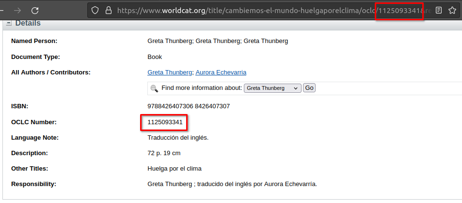
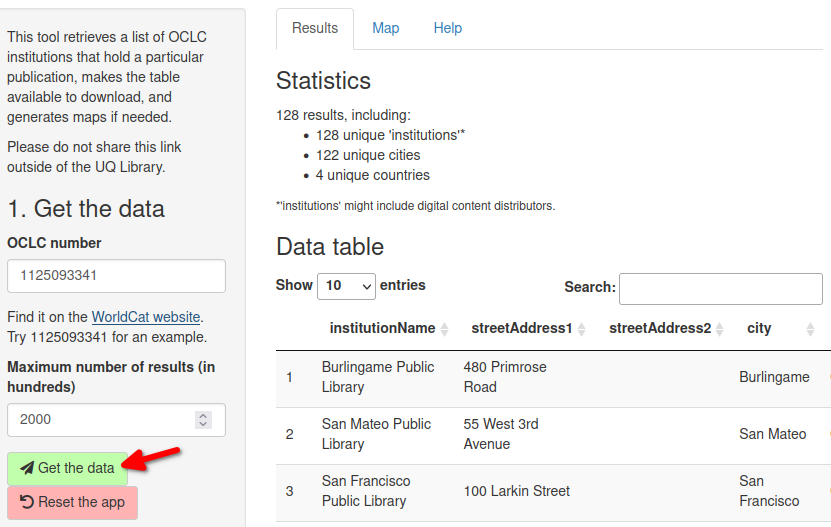
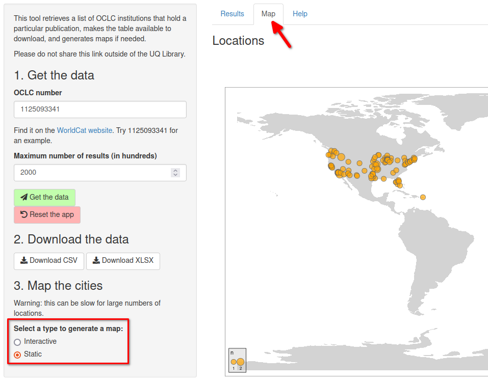

### Instructions

#### 1. Get the data

Find the OCLC number of a publication. This can be found on the
publication’s page on the [WorldCat website](https://www.worldcat.org/),
or in its URL.

<figure>

<figcaption aria-hidden="true">A book’s OCLC number can be found either
in the “Details” box or the URL of the item’s page on
worldcat.org.</figcaption>
</figure>

Click “Get the data”. Some summary statistics and an interactive table
of the returned data will appear in the “Results” tab.

<figure>

<figcaption aria-hidden="true">Click the “Get the data” button to fetch
the results. Summary statistics and a searchable table will be
displayed.</figcaption>
</figure>

#### 2. Download the data

You can choose to download the data in either CSV or XLSX formats with
the sidebar buttons to open it in another application.

#### 3. Map the cities

If a map is needed, select the type of map you want to create
(“interactive” or “static”). The visualisation will appear in the “Map”
tab.

<figure>

<figcaption aria-hidden="true">Pick between “Interactive” and “Static”
to generate a map. The “Map” tab should automatically get
focused.</figcaption>
</figure>

### About

This tool was developed using the [OCLC
API](https://developer.api.oclc.org/), the [R programming
language](https://www.r-project.org/) and the
[Shiny](https://shiny.rstudio.com/) framework.

For further help or to report issues, please contact either:

-   Stéphane Guillou: s.guillou (at) uq.edu.au

-   Technology trainers: training (at) library.uq.edu.au
